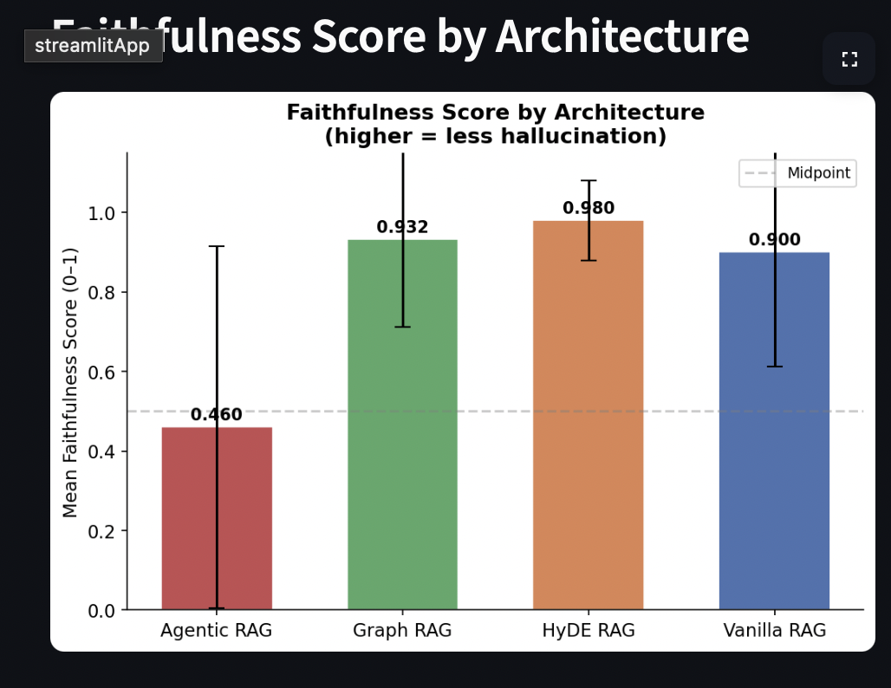
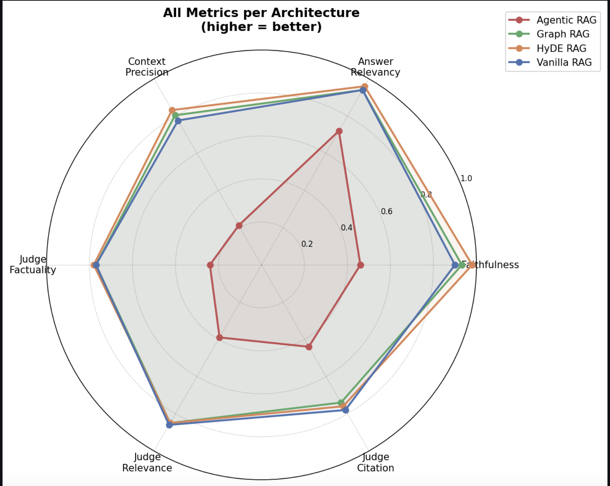
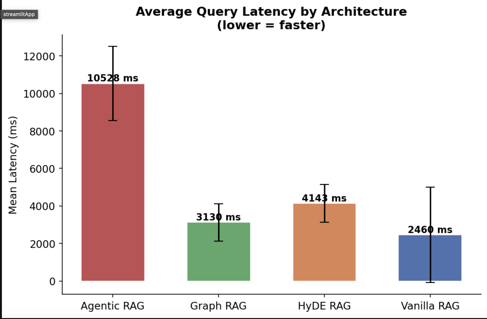
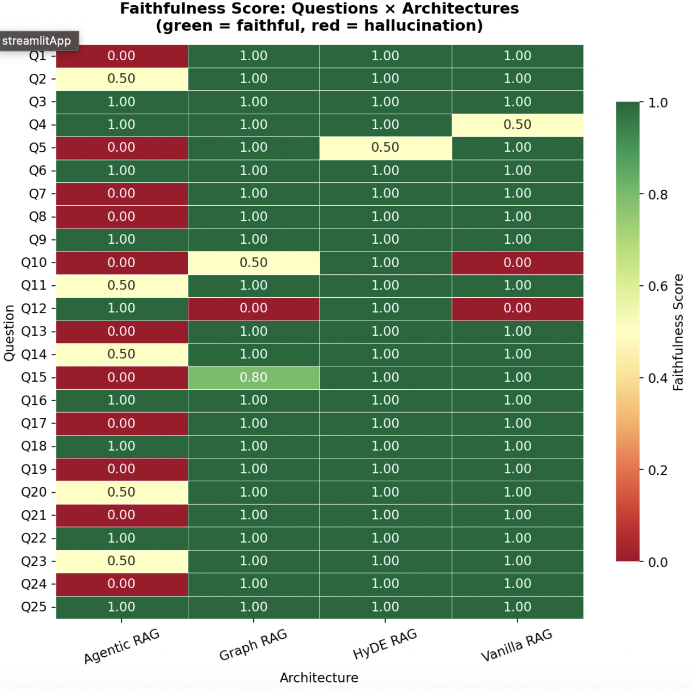

# RAG Architecture Comparison Experiment

A structured research experiment comparing four RAG (Retrieval-Augmented Generation) architectures on their ability to **reduce hallucinations** when answering questions about AI/ML research papers from ArXiv.

---

## What This Experiment Tests

| Architecture | Core Idea |
|---|---|
| **Vanilla RAG** | Embed query → retrieve chunks → answer (baseline) |
| **HyDE RAG** | Generate hypothetical answer → embed it → retrieve with that embedding |
| **Graph RAG** | Build a knowledge graph from paper entities → traverse graph + vector search |
| **Agentic RAG** | LLM agent uses tools iteratively to gather evidence before answering |

Each architecture answers the **same 25 questions** about the **same 25 ArXiv papers**.  
Results are evaluated on faithfulness, relevance, context precision, and latency.

---

## Project Structure

```
research_experiment/
├── data/                          # Auto-generated on first run
│   ├── papers.json                # Cached ArXiv papers
│   ├── questions.json             # Generated evaluation questions
│   ├── knowledge_graph.json       # GraphRAG entity graph (cached)
│   ├── chroma_db/                 # ChromaDB vector store
│   └── rag_comparison_results.csv # Final results
├── architectures/
│   ├── vanilla_rag.py             # Standard RAG baseline
│   ├── hyde_rag.py                # Hypothetical Document Embeddings
│   ├── graph_rag.py               # Knowledge graph + vector hybrid
│   └── agentic_rag.py             # ReAct agent with tools
├── evaluation/
│   ├── ragas_eval.py              # RAGAS metrics (with LLM fallback)
│   └── llm_judge.py               # Blind LLM-as-judge (1-5 scores)
├── visualizations/
│   ├── charts.py                  # All 4 chart generators
│   └── output/                    # Saved PNG files
├── utils/
│   ├── llm_client.py              # Unified OpenAI / Anthropic wrapper
│   ├── embedder.py                # Sentence-transformers singleton
│   └── data_loader.py             # Paper fetching + question generation
├── main.py                        # Experiment orchestrator (run this)
├── config.py                      # All tunable parameters
└── requirements.txt
```

---

## Setup

### 1. Install dependencies

```bash
pip install -r requirements.txt
```

> Python 3.9+ required.

### 2. Set your API key

The experiment requires **either** an Anthropic or OpenAI key.

```bash
# Anthropic (default)
export ANTHROPIC_API_KEY="sk-ant-..."

# OpenAI (alternative)
export OPENAI_API_KEY="sk-..."
export LLM_PROVIDER=openai
```

Or create a `.env` file in the project directory:
```
ANTHROPIC_API_KEY=sk-ant-...
```

### 3. (Optional) Override configuration

```bash
export LLM_MODEL=claude-haiku-4-5-20251001   # model for answer generation
export JUDGE_MODEL=claude-sonnet-4-6          # stronger model for evaluation
export NUM_PAPERS=25
export TOP_K=5
```

---

## Running the Experiment

### Full run (recommended)

```bash
python main.py
```

This will:
1. Fetch 25 ArXiv ML papers (cached after first run)
2. Generate 25 evaluation questions (cached after first run)
3. Index all papers into ChromaDB
4. Run all 4 architectures × 25 questions = 100 LLM answer calls
5. Evaluate each answer (~200 additional LLM calls for scoring)
6. Save results CSV and 4 PNG charts
7. Print a summary table in the terminal

**Estimated time:** 30–60 minutes (most time is LLM API latency)  
**Estimated cost:** $2–8 depending on model choice

### Quick test (verify everything works)

```bash
python main.py --dry-run
```

Runs only 2 questions per architecture (~8 LLM calls total).

### Resume interrupted run

```bash
python main.py --skip-existing
```

Skips questions already present in `data/rag_comparison_results.csv`.

### Run a single architecture

Each architecture file is independently runnable:

```bash
python architectures/vanilla_rag.py
python architectures/hyde_rag.py
python architectures/graph_rag.py
python architectures/agentic_rag.py
```

### Regenerate charts from existing results

```bash
python visualizations/charts.py
```

---

## Outputs

| File | Description |
|---|---|
| `data/rag_comparison_results.csv` | Full results (one row per question × architecture) |
| `visualizations/output/faithfulness_bar.png` | Mean faithfulness per architecture |
| `visualizations/output/latency_bar.png` | Mean query latency per architecture |
| `visualizations/output/radar_chart.png` | All metrics per architecture (spider chart) |
| `visualizations/output/faithfulness_heatmap.png` | Per-question faithfulness heatmap |

---

## Results Preview

> Screenshots from an actual experiment run across all 4 architectures.

### Faithfulness Comparison


### Radar Chart — All Metrics


### Latency Comparison


### Per-Question Faithfulness Heatmap


---

## Evaluation Metrics

### RAGAS Metrics (0–1, higher is better)

| Metric | What it measures |
|---|---|
| `faithfulness` | Does the answer contain ONLY facts present in the retrieved context? This is the primary hallucination metric. |
| `answer_relevancy` | Does the answer actually address the question? |
| `context_precision` | Are the retrieved chunks relevant to the question? |

### LLM-as-Judge Scores (1–5, higher is better)

| Metric | What it measures |
|---|---|
| `judge_factuality` | Is the answer factually consistent with the source papers? |
| `judge_relevance` | Does the answer address the question? |
| `judge_citation` | Are the papers/sources correctly cited? |

The judge is **blind** — it does not know which architecture generated the answer.

---

## Interpreting Results

- **Faithfulness** is the most important metric for hallucination reduction research.
- **HyDE** often improves retrieval for vague questions but adds one extra LLM call.
- **GraphRAG** can excel on relationship questions ("which papers cite X?") but may underperform on simple fact lookup.
- **Agentic RAG** has the highest latency (multiple tool calls) but can self-correct when the first retrieval fails.
- **Vanilla RAG** is the hardest baseline to beat in practice — don't be surprised if it wins on some metrics.

---

## Configuration Reference

All settings in `config.py` can be overridden via environment variables:

| Variable | Default | Description |
|---|---|---|
| `LLM_PROVIDER` | `anthropic` | `anthropic` or `openai` |
| `LLM_MODEL` | `claude-haiku-4-5-20251001` | Model for answer generation |
| `JUDGE_MODEL` | `claude-sonnet-4-6` | Model for evaluation judging |
| `TOP_K` | `5` | Chunks retrieved per query |
| `CHUNK_SIZE` | `512` | Characters per document chunk |
| `CHUNK_OVERLAP` | `50` | Character overlap between chunks |
| `NUM_PAPERS` | `25` | ArXiv papers to fetch |
| `NUM_QUESTIONS` | `25` | Evaluation questions to generate |
| `AGENT_MAX_STEPS` | `5` | Max tool calls for Agentic RAG |

---

## Troubleshooting

**`ANTHROPIC_API_KEY is not set`**  
→ Run `export ANTHROPIC_API_KEY=your-key` before running the experiment.

**ChromaDB collection already exists but looks wrong**  
→ Delete `data/chroma_db/` and re-run. `index_papers()` will rebuild.

**RAGAS import fails**  
→ The experiment falls back to its own LLM-based metric computation automatically. Check logs for `"Falling back to LLM judge"`.

**Graph building is slow**  
→ Entity extraction makes one LLM call per paper. With 25 papers this takes a few minutes. The result is cached in `data/knowledge_graph.json`.

**Want to use Neo4j instead of NetworkX**  
→ GraphRAG currently uses NetworkX as a pure-Python fallback. To add Neo4j, integrate `neo4j-driver` in `graph_rag.py`'s `build_graph()` function.
